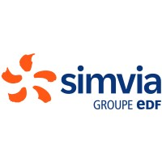

class: middle, slide_title


<div class="slide-decor"></div>

# UE12 </br> Apprentissage de la programmation

## Introduction au `C`

<br><br><br><br><br><br>

<div style="position: absolute; bottom: 2%; left: 50%; transform: translate(-50%, 0%) scale(0.8);">
<div class="profile-card">
  <div class="banner"></div>
  
  <div class="content">
    <h3 class="name">Basile Marchand</h3>
    <p class="title">Ingénieur calcul scientifique et HPC</p>
    <div class="company">
      
    </div>
    <a href="https://www.linkedin.com/in/basilemarchand/" target="_blank" class="btn-linkedin">
      
      Voir le profil
    </a>

  </div>
</div>

</div>

---

layout: true


<div class="slide_footer">
    <div class="wrap">
        <span>2025 - <i> Introduction au C ? ✨ </i>  </span>
    </div>
</div>

<div class="linkedin-footer">
<a href="https://www.linkedin.com/in/basilemarchand/" target="_blank" class="linkedin-badge">
  
  <span>@basilemarchand</span>
</a>
</div>

<div class="slide-decor"></div>

---

---

# La genèse du `C`

.cols[
.fifty[

**Langage historique**

Le `C` est développé dans les années 1970 par deux scientifiques des laboratoires Bell :

- Dennis Ritchie
- Ken Thompson

L'ambition initiale est de créer un langage de programmation bas niveau pour réécrire le système d'exploitation UNIX, initialement écrit en assembleur.

Cela donna naissance en 1972 au langage `C`, qui devint rapidement populaire pour son efficacité et sa portabilité.
]
.fifty[

<figure>

<figcaption> K. Thompson et D. Ritchie </figcaption>
</figure>

    ]

]

---

# Le C en 4 caractéristiques

.center[
Bas niveau, impératif, typé statiquement, compilé
]

---

# C un langage bas niveau

Le C est un langage dit **bas niveau** car il offre un niveau d'abstraction moindre, vis à vis du hardware, des des langages de plus haut niveau comme Python. Dit autrement il va falloir comprendre un peu ce qui se passe dans un ordinateur pour être efficace.
<br><br>
L'aspect bas niveau du C se manifeste par :

- La gestion manuelle de la mémoire (allocation, libération)
- L'utilisation de pointeurs pour manipuler directement les adresses mémoire
- Un contrôle précis sur les types de données et leur représentation en mémoire
- Possibilité de manipulers des registres vectoriels (SSE, AVX, ...)

---

# C un langage impératif

Dans le monde de la programmation, il existe ce qu'on appelle des **paradigmes de programmation**. En gros c'est le style de programmation : fonctionnel, orienté objet, impératif, ...

Certains langages sont multi-paradigmes, i.e. permettent de programmer dans plusieurs styles. C'est le cas par exemple du C++, Python, JavaScript, ...

En revanche le C est un langage **impératif**. Cela signifie que la programmation se fait en décrivant une série d'instructions qui modifient l'état du programme. C'est grosso-modo le paradigme de la plupart des langages que vous avez pu croiser.

---

# C un langage statiquement typé

LA première grosse différence avec ce que vous avez pu voir jusqu'à maintenant.

.cols[
.fifty[
<br>

```python
>>> ma_variable = "coucou"
>>> type(ma_variable)
<class 'str'>
>>> ma_variable = 42
>>> type(ma_variable)
<class 'int'>
```

]
.fifty[
En Python vous avez l'habitude de définir une variable, lui affecter une valeur d'un certain type et ensuite lui affecter une valeur d'un autre type. La notion de type en Python existe. Mais le typage est dynamique et vous n'avez pas à vous en préoccuper.
]
]

En `C` cela va être le grand bouleversement pour vous, les variables sont statiquement typées, i.e. :

- Vous devez spécifier vous même le type des variables que vous créées
- Le type d'une variable ne peut pas être modifié au cours de l'exécution du programme !!

---

# Typage statique illustration

En `C` pour définir une variable il faut nécessairement indiquer son type

```c
  int ma_variable = 42;
```

Une fois `ma_variable` défini comme étant un `int`, impossible de lui affecter autre chose qu'un `int`.

```c
  ma_variable = "coucou"; /// 🛑 erreur !!!
```

---

# C un langage compilé

**LA** compilation, le truc qui là va vous perturber le plus.

.center[Mais c'est quoi la compilation ?]

Cela signifie que le code source que vous écrivez doit être transformé en code machine par un programme appelé compilateur avant de pouvoir être exécuté.

Par opposition, des langages comme Python ou JavaScript sont interprétés, i.e. le code source est exécuté directement par un interpréteur sans étape de compilation préalable. Quand vous exécuter un script Python, c'est l'interpréteur `Python` qui lit et exécute le code ligne par ligne.

```bash
$ python mon_script.py
```

---

# C un langage compilé

## Le compilateur

Pour réaliser cette opération de compilation on doit donc utiliser un programme externe appelé le compilateur. Ce programme va lire le code source que vous avez écrit et le transformer en code machine.

Les compilateurs C les plus couramment utilisés sont :

- GCC (GNU Compiler Collection)
- Clang (LLVM)
- MSVC (Microsoft Visual C++)

.def[Dans les faits, c'est un peu plus compliqué que ça. Le compilateur effectue plusieurs étapes intermédiaires avant d'arriver au code machine final. Et il est appuyé par d'autres outils comme l'éditeur de liens (linker) qui assemble les différents morceaux de code compilé en un exécutable final. Puis il y a aussi le préprocesseur qui traite les directives spéciales dans le code source avant la compilation proprement dite.
]

---

# C un langage compilé

## On fait comment ?

C'est très simple. Considérons l'exemple classique du Hello World. Le code C pour afficher le message Hello World est le suivant :

.cols[
.fifty[

```c
#include <stdio.h>
#include <stdlib.h>

int main(){
  printf("Hello, World!\n");
  return EXIT_SUCCESS;
}
```

]
.fifty[
Pour compiler ce code source en un exécutable, on utilise la commande suivante

```bash
$ gcc hello.c -o hello
```

]
]
où `gcc` est le compilateur, `hello.c` est le fichier source, et `-o hello` spécifie le nom de l'exécutable généré.

.cols[
.fifty[
**Attention** le code a été compilé mais pas exécuté. C'est à vous ensuite de lancer l'exécutable généré.
]
.fifty[

```bash
$ ./hello
```

]
]

---

# C un langage compilé

## Pleins d'info en vrac

- Le code source C est généralement stocké dans des fichiers avec l'extension `.c` pour les fichiers source et `.h` pour les fichiers d'en-tête (headers).
- Le processus de compilation peut être divisé en plusieurs étapes : prétraitement, compilation, assemblage et édition des liens.
- Les options de compilation peuvent être utilisées pour contrôler divers aspects du processus de compilation, comme le niveau d'optimisation, les avertissements, etc.
- **Par défaut le code compilé n'est pas compatible avec un autre OS ou une autre architecture matérielle.** Il faut recompiler le code source sur la plateforme cible pour obtenir un exécutable compatible.

---

# C un langage compilé

## Un mot sur les options de compilation

Une grande devise dans le monde du C est :
.center[**"Trust the compiler, not the programmer."**]

Et une autre devise que j'aime bien :
.center[**"Le warning d'aujourd'hui est l'erreur de demain."**]

Personnellement je vous conseillerais de compiler vos codes avec les options suivantes :

```bash
$ gcc -Wall -Wextra -Wpedantic -fanalyzer mon_code.c -o mon_executable
```

Alors oui cela donne des choses assez verbeuses et détecte beaucoup de choses, mais au moins si vos code compilent avec ces options sans aucuns warning vous partez avec des bases saines.

---

# C un langage compilé

## Démo des options

Considérons le code suivant :

.cols[
.fifty[

```c
#include <stdio.h>
#include <stdlib.h>

int main(){
  int a = 42;
  double x;
  x += (double)a;
  return EXIT_SUCCESS;
}
```

Sans aucune option de compilation ce code compile parfaitement sans aucune warning.
]
.fifty[

.small[

```bash
$ gcc -Wall -Wextra -Wpedantic -fanalyzer test.c
test.c: In function ‘main’:
test.c:8:5: warning: ‘x’ is used uninitialized [-Wuninitialized]
    8 |   x += (double)a;
      |   ~~^~~~~~~~~~~~
test.c:7:10: note: ‘x’ was declared here
    7 |   double x;
      |          ^
test.c:8:5: warning: use of uninitialized value ‘x’ [CWE-457] [-Wanalyzer-use-of-uninitialized-value]
    8 |   x += (double)a;
      |   ~~^~~~~~~~~~~~
  ‘main’: events 1-2
    |
    |    7 |   double x;
    |      |          ^
    |      |          |
    |      |          (1) region created on stack here
    |    8 |   x += (double)a;
    |      |   ~~~~~~~~~~~~~~
    |      |     |
    |      |     (2) use of uninitialized value ‘x’ here
```

]
]
]

---

# Structure générale d'un programme C

## Le point d'entrée

Dans un programme Python, le point d'entrée, i.e. là où commence l'exécution de votre programme c'est la première ligne du fichier Python que vous exécutez.

.center[En `C` la logique est un peu différente]

Le point d'entrée d'un programme `C` (c'est d'ailleur la même chose pour en `C++`) c'est une fonction. Cette fonction s'appelle nécessairement `main`.
.cols[
.fifty[

```c
#include <stdio.h>
#include <stdlib.h>

int main(){
  ....
  return EXIT_SUCCESS;
}
```

]
.fifty[
Cette fonction retourne un entier, cet entier peut-être récupéré dans le terminal à l'issue de l'exécution du programme en utilisant `$?`
]
]

---

# Structure générale d'un programme C

## Les includes

Dans un programme C on trouver généralement en haut du fichier `.c` des instructions de la forme
`#include <truc.h>`.

Il s'agit d'une directive de pré-compilation. Elle signigie litéralement qu'il faut inclure dans le fichier courant, le contenu du fichier `truc.h` avant de passer à l'étape de compilation à proprement parlé.

Le fichier `truc.h` est ce qu'on appelle un fichier d'en-tête, _header_ file. C'est fichier permettent de déclarer au compilateur que des fonctions que l'on a pas codé soit-même existent.

Par exemple quand on utilise `printf` pour afficher un message on doit faire un `#include  <stdio.h>` sinon le compilateur nous dit qu'il ne connait pas `printf`.

---

# Les variables

## Le principe d'une variable

Une variable c'est quoi ? C'est tout simplement une étiquette, un nom, que l'on associe à une zone mémoire dnas laquelle sera stockée la valeur associée à la variable.

La notion de type apparaît alors pour permettre deux choses :

1. Déterminer la taille nécessaire en mémoire pour stocker la valeur d'une variable
2. Savoir comment interpréter une série de `0` et de `1`, car pour une méme zone mémoire, l'interprétation ne sera pas la même suivant si on considère un entier ou bien un flottant.

---

# Les variables

## Déclaration vs affectation

La déclaration d'une variable se fait en suivant le pattern suivant :

```c
type nom_variable;
```

En `C` il n'y a pas une convention de nommage de variables, contrairement à Python et la PEP8. A vous de choisir ce que vous voulez, essayez juste d'être cohérent d'un bout à l'autre du code. Les noms de variables doivent répondre à quelques rêgles élémentaires :

- Commencer par une lettre
- Pas d'espace
- Pas de caractères spéciaux

---

# Les Types

Le `C` met à disposition un certain nombre de type de _base_. C'est type sont des types numériques il s'agit de

---

# Les types

## Quelques mots sur les entiers

---

# Les types

## Quelques mots sur les flottants

---

# Les types

## Utilisation des suffix

---

# Les types

## Pas de mélange des genres

Le `C` de par sa nature fortement typé, n'est pas très adepte du mélange des genres. Par exemple lorsque vous faites :

.cols[
.fifty[

```c
int a = 42;
float b = 0.1;
double c = 43.0;

double out = a*b + c;
```

]
.fifty[
Le résultat est défini comme étant un double et c'est logique. Mais en interne du `C` que se passe-t-il à votre avis ?
]
]

--

Et bien le `C` va automatiquement changer les types des variables `a`, `b` et du résultat de `a*b`

.cols[
.fifty[

```c
double out = (double)((float)a*b) + c;
```

]
.fifty[
La conversion automatique se fait uniquement dans le sens où il est garanti qu'il n'y aura **pas de perte** d'information.
]
]

---

# Les types

## Opération de cast

Cette opération de conversion d'une valeur d'une variable d'un type vers un autre est ce qu'on appelle un **_cast_**.
Le **_cast_** peut être :

- Implicite : c'est le compilateur qui choisi de le faire, c'est par exemple ce qui est arrivé dans l'exemple de la slide précédente
- Explicite : c'est le développeur qui va spécifier, via une syntaxe partciulière, que la valeur d'une variable doit être interpréter d'une manière différente.

Cette syntaxe particulière est la suivante :
.cols[
.fifty[

```c
(target_type)source_variable;
```

]
.fifty[

```c
int a=42;
double x=(double)a;
```

]
]

.cols[
.fourty[
Une astuce que j'aime bien
]
.sixty[

```c
#define static_cast(type, value) ((type)(value))

double x=static_cast(double, a);

```

]

]

---

# Les types

## Un mot sur les char

---

# Les types

## Les booléens

En `C` depuis la norme C23 le type `bool` est devenu un type natif du langage ainsi que les constante `true` et `false`.

On peut inclure l'en-tête `<stdbool.h>` pour utiliser ce type dans les versions antérieures de la norme C. On dispose avec les booléens, de toutes les opérations logiques classiques : `&&` (et), `||` (ou), `!` (non). Le Xor logique n'est pas natif mais on peut l'implémenter facilement.

Les booléens nous servirons surtout dans les opérations de branchements, ou bien comme conditions d'arrêt dans les boucles.

---

# Les types et variables

## Notion de scope

La portée d'une variable, son scope, correspond à la portion du code qui a la possibilité d'accéder à cette variable en lecture(/écriture). En `C` le scope d'une variable est restreint au bloc d'instruction dans lequel cette variable est définie. Bloc d'instruction = portion de code contenu entre deux accolades `{` `}`.

```c
// Scope principal A
int a;
{ // DEBUT du Scope secondaire A.1
  a = 42; // Ok car appartenant à A
  int b = a+1;
  { // DEBUT du Sous-sous-scope A.1.1
    printf("La valeur de b est %d", b); // Ok
  } // FIN du sous-sous-scope A.1.1
} // FIN du sous-scope A.1
{
  printf("La valeur de a est %d", a); // Ok est affiche 42
  printf("La valeur de b est %d", b); // NOT OK car b a été détruit
                                      // à la FIN de A.1
}
```

---

# Les types

## Qualificateur `const`

A une variables est associée un type, auquel on peu ajouter un qualificateur via le mot clé `const`.

Tout simplement, cela permet de spécifier au compilateur que la valeur de la variable en question ne changera **jamais**. Par exemple

```c
const size_t nb_eleve_dans_mon_groupe = 17;
```

---

# Les types

## `sizeof`

Une fonction que l'on va être amené à beaucoup manipuler par la suite de votre avanture dans le monde du `C` est `sizeof`. `sizeof` permet de récuper la taille mémoire **en octet**, d'une variable **ou** d'un type.
.cols[
.sixty[

```c
int a = 42;
float b = 0.1;
double c = 43.0;
size_t sz_a = sizeof(a);
printf("Size of a: %zu\n", sz_a);
printf("Size of int: %zu\n", sizeof(int));
size_t sz_b = sizeof(b);
printf("Size of b: %zu\n", sz_b);
printf("Size of float: %zu\n", sizeof(float));
size_t sz_c = sizeof(c);
printf("Size of c: %zu\n", sz_c);
printf("Size of double: %zu\n", sizeof(double));
```

]
.thirty[

```shell
$ ./a.out
Size of a: 4
Size of int: 4
Size of b: 4
Size of float: 4
Size of c: 8
Size of double: 8
```

]
]

---

# Les types et variables

## Je suis rangé où `&`

Pour finir sur notre tour d'horizon rapide des types et variables on va voir une petite chose, qui pour le moment va vous sembler au mieux étrange, au pire inutile, c'est la possibilité de récupérer l'adresse mémoire d'une variable.

```c
int a = 42;
printf(f"L'adresse en mémoire de a est %p", (void *)&a);
```

```bash
$ ./a.out
L'adresse en mémoire de a est 0x7fff63dcce74
```

---

class: middle,

# Types et variables en trois rêgles

1. Une variable doit être déclarée avant d'être utilisée, au plus proche de son premier usage.
2. La conversion de type, doit toujours être faite explicitement pour assurer la portabilité entre plateforme
3. Tout ce qui est constant doit être `const`

---

# Les contrôles du flux d'exécution

Dans tout programme informatique, il arrive régulièrement que suivant l'état courant du programme on veuille faire une chose plutôt qu'une autre. On parle de branchement. En `C` on retrouve, ce que vous avez déjà vu par ailleurs à plusieurs structures de contrôles qui permettent d'aiguiller l'exécution de votre programme.

Les structures de contrôles en `C` sont les suivantes :

- `if` ... `else if` ... `else` : le classique que vous connaissez déjà
- `swicth` ... `case` : du old school qui a son intérêt, mais pas indispensable
- `goto` : un truc de vieux, donc forcément bien

---

# Les contrôles du flux d'exécution

## `if`, `else if`, `else`

La structure de contrôle `if` est celle que vous connaissez à coup sur. Le comportement est le même en `C` que celui que vous avez déjà vu en Python. La seule différence est dans la syntaxe

```c
int age= ... ;
if( age < 18){
  printf("");
}
else if(age >= 18 && age <=35){
  printf("Encore jeune");
}
else{
  printf("Commence certainement à être usé");
}
```

---

# Les contrôles du flux d'exécution

## `switch`

Alternative au `if` qui repose sur la comparaison d'une valeur avec différents cas possibles. On est donc sur des égalités strictes, contrairement au `if` où l'on peut utiliser n'importe quelle expression booléenne.

.cols[
.seventy[

```c
switch (variable){
  case 7:
    printf("Le nombre d'Horcruxe");
    break;
  case 9:
    printf("Le nombre de biju");
    break;
  case 42:
    printf("42 est la réponse à la question universelle");
    break;
  default:
    printf("Star Wars c'était mieux avant Disney");
}

```

]
.thirty[
**Attention** le mot-clé `break` indique qu'une fois rentré dans un `case` le code doit sortir du `switch`. Sans le `break` tous les cases suivants seraient exécutés.
]
]

---

# Les contrôles du flux d'exécution

## `Switch` sans le `break`

Par exemple :
.sixty[

```c
printf("A l'age de %d tu es \n")
switch (age){
  case 35:
    printf("Plein de sagesse\n");
  case 30:
    printf("au top de ta carrière\n");
  case 25:
    printf("Dans une forme olympique\n");
  case 20:
    printf("Débordant d'énergie");
}
```

]
.cols[
.sixty[
Et oui, sans le `break` dès qu'on rentre dans un `case` on passe par tous les suivants. Cela peut avoir un intérêt mais il faut bien le maîtriser et savoir ce que l'on fait.
]
.fourty[

```bash
$ ./a.out
A l'age de 35 tu es
Plein de sagesse
au top de ta carrière
Dans une forme olympique
Débordant d'énergie
```

]
]

---

# Les contrôles du flux d'exécution

## `goto`

Le `goto` est une commande qui permet de sauter directement à une étiquette ailleurs dans le même bloc d'instruction.

.cols[
.fifty[

```c
int x=42;
x += 1;
if(x == 43){
goto etiquette;
}
printf(" x = %d\n", x);
etiquette:
printf("Atteint l'étiquette\n");
```

```bash
$ ./a.out
Atteint l'étiquette
```

]
.fifty[
La ligne qui affiche la valeur de `x` n'est pas exécuté car on passe par le `goto` avant et donc on saute directement aux denières lignes.

**Attention** le `goto` n'est généralement pas recommandé, car mène à des codes compliqués à lire et maintenir. Il ne doit être utilisé que si vraiment il permet un gain de clarete/simplicité du code.  
]
]

---

# Les boucles

Une des forces de l'ordinateur, par rapport à l'humain, c'est qu'il accepte de répéter les mêmes opérations autant de fois que nécessaire (i.e. qu'on lui demande). Car généralement, un programme informatique est fait pour traiter un gros paquet de données. Et rien de mieux pour cela que faire des boucles. Le `C` comme beaucoup d'autre langage a à sa disposition deux solutions pour faire des boucles.

- La boucle `for` qui permet de répéter `N` fois un bloc d'instruction, avec `N` connu à l'avance
- La boucle `while` qui permet de répéter tant qu'une condition n'est pas satisfaite, un bloc d'instuction.

---

# Les boucles

## `while` et `do` ... `while`

La boucle `while` en `C` ressemble énormément à ce que vous connaissez en Python.

.cols[
.fifty[

```c
int i=0;
while(i<10){
  i+=1;
  printf("i=%d\n", i);
}
```

]

]

.cols[
.fifty[
La version `do{...} while ()` évalue la condition en fin de chaque itération, ce qui permet de rentrer dans le while au moins une fois même si à l'état initiale la conditions d'arrêt est déjà satisfaite.
]
.fifty[

```c
int i=-2;
do {
  i+=1;
  printf("i=%d", i);
} while( i>0);
```

]
]

---

# Les boucles

## `for`

La boucle `for` pour le coup diffère un petit peu de ce que vous connaissez en Python. En Python, la boucle `for` parcourt des **itérables** alors qu'en `C` la boucle `for` est destinée au boucles comptées, i.e. boucle sur un index que l'on incrémente/décrémente. La syntaxe typique est

```c
for( initialisation ; test ; incrémentation ){
  // Corps de la boucle
}
```

.cols[
.fifty[
Par exemple pour afficher les entiers de 0 à 9 on peut procéder de la manière suivante :
]
.fifty[

```c
for(size_t i=0; i<10; i++){
  printf("i = %zu", i);
}
```

]
]

---

# Les boucles

## `for` - deux, trois petites choses

.cols[
.fifty[
La variable compteur d'une boucle `for` peut-être définie en dehors de la boucle.
]
.fifty[

```c
size_t i;
for(i=0; i<10; i++){
  ...
}
```

]
]

.cols[
.fifty[

```c
size_t i=0;
for(; i<10; i++){
  ...
}
```

]
.fifty[
On peut même se passer d'un ou plusieurs éléments entre parenthèses du `for`
]
]

---

# Les boucles

## `break` and `continue`

Comme en Python, il existe les deux mots clés `break` et `continue` qui permettent de modifier l'exécution d'une boucle `for` ou `while`.

---

class: middle

# Branchements et boucles

1.
2.
3.

---

# Les fonctions

---

# Programme des séances

.cols[

.fifty[

- Séance 1 : 28/10

  - Toute la base du C,
  - variables, types,
  - branchements, boucles,
  - fonctions

- Séance 2 : 04/11

  - Types dérivés : tableaux, struct, pointeurs
  - Coding style et clean code

- Séance 3 : 09/12

  - LA mémoire

- Séance 4 : 16/12

  - La librairie standard C

]
.fifty[

- Séance 5 : 06/01

  - Astuces avancées : préprocesseur, macro
  - Industrialisation : chaînes de compilation

- Séance 6 : 13/01

  - Utilisation de librairies externes
  - GNU Scientific Library
  - SDL

- Séance 7 : 20/01

  - Tests unitaire
  - Profiling de code

- Séance 8 : 21/01

  - Gestion des erreurs

- Séance 9 : 27/01

  - Projet
    ]

]

<div style="position: absolute; top: 53%; left: 31%;opacity: 0.2">
<iframe src="https://giphy.com/embed/okFG5aJWqRGMYXoKTD" width="280" height="280" style="" frameBorder="0" class="giphy-embed" allowFullScreen></iframe>
</div>

<div style="position: absolute; top:50%; left:75%; opacity: 0.2">
<iframe src="https://giphy.com/embed/GghGKaZ8JeHJx0apQC" width="280" height="280" style="" frameBorder="0" class="giphy-embed" allowFullScreen></iframe>
</div>

---

class: center, middle

🧱 Le C, c’est le langage qui a bâti l’informatique moderne.
<br><br><br>

⚡ Si Python, JavaScript et compagnie sont des voitures de course… le C, c’est le moteur.
<br><br><br>

🌌 Tous les grands projets du calcul scientifique, de la simulation au spatial, s’appuient sur lui.
<br><br><br>

🔍 Apprendre le C, c’est comprendre comment tout fonctionne — vraiment.
<br><br><br>

```

```

```

```

```

```

```

```

```

```

```

```

```

```

```

```
