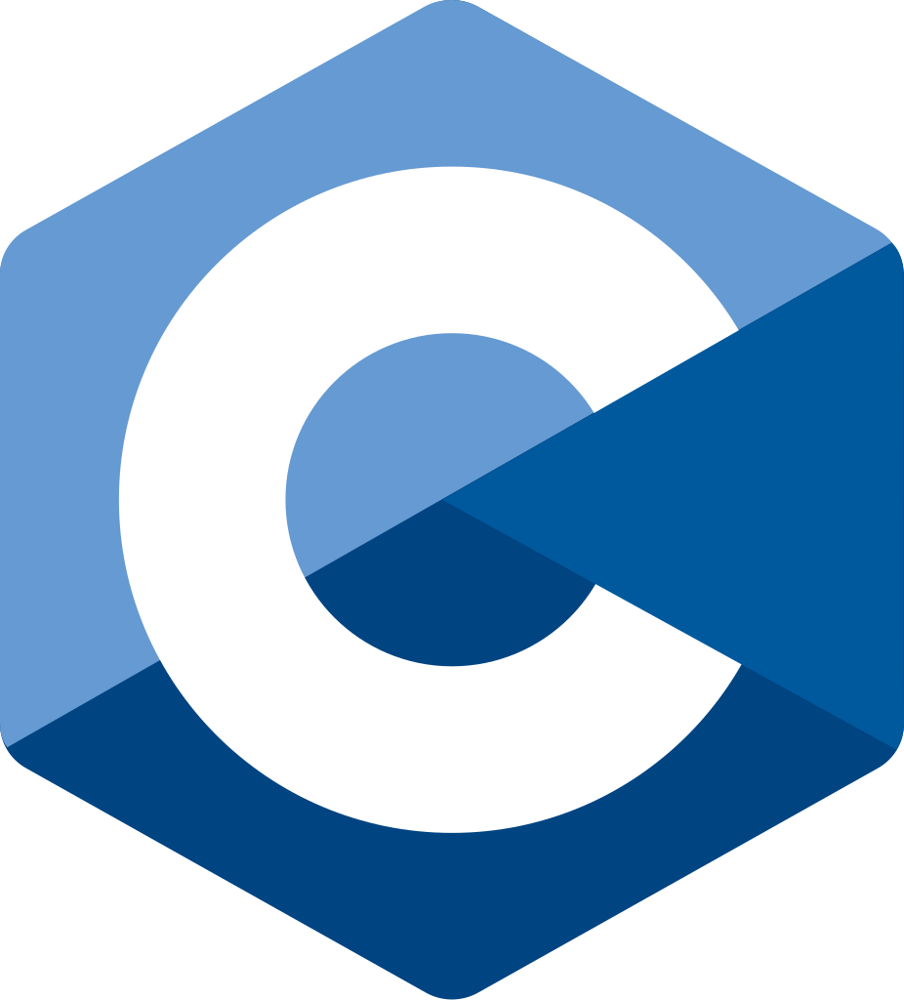

class: middle, slide_title



<div class="slide-decor"></div>

# UE12 </br> Apprentissage de la programmation

## Programmation en `C` ️

<br><br><br><br><br><br>

<div style="position: absolute; bottom: 2%; left: 50%; transform: translate(-50%, 0%) scale(0.8);">
<div class="profile-card">
  <div class="banner"></div>
  
  <div class="content">
    <h3 class="name">Basile Marchand</h3>
    <p class="title">Ingénieur calcul scientifique et HPC</p>
    <div class="company">
      
    </div>
    <a href="https://www.linkedin.com/in/basilemarchand/" target="_blank" class="btn-linkedin">
      
      Voir le profil
    </a>

  </div>
</div>

</div>

---

layout: true


<!--  -->

<div class="slide_footer">
    <div class="wrap">
        <span>07/10/2025 - <i> Pourquoi choisir d'apprendre le C ? ✨ </i>  </span>
    </div>
</div>

<div class="linkedin-footer">
<a href="https://www.linkedin.com/in/basilemarchand/" target="_blank" class="linkedin-badge">
  
  <span>@basilemarchand</span>
</a>
</div>

<div class="slide-decor"></div>

---

---

# Le `C` en quelques mots

.cols[
.fifty[

**Langage historique**

mais encore bien vivant, création du langage dans les années 70, mais des standards qui continuent à évoluer `C99`, `C11`, `C23`, ... Et une reconnaissance, depuis 20 ans `C` est dans le top 5 des langages de programmation [1]

**Syntaxe simple**

On a rapidement fait le tour de l'essentiel, ce qui permet de vite passer à la pratique. Et pour le coup rien de magique tout est explicite, le langage ne vous cache rien.

**Statiquement typé** et **bas niveau**

Si vous voulez en savoir plus sur comment se font les interactions entre un code informatique et le hardware, pas mieux que le C.

]
.fifty[

```c
#include <stddef.h>
#include <stdint.h>
#include <stdio.h>

typedef struct Point Point;

struct Point{
    double x;
    double y;
};

int main(){
    int32_t i = 42;
    int64_t j = 42;
    uint8_t k = 255;
    float x = 0.000001;
    double y = 0.0000000000001;


    double *pcloud = malloc(10*sizeof(Point));
    Point p{.x=0.34, .y=103.24};

    size_t idx = find_closest(&p, pcloud);

    char* msg = "Hello World !\n";
    prinf(msg);
    free(array);
    return EXIT_SUCCESS;
}
```

    ]

]

.footnote[1 - Index Tiobe]

---

# Un langage caché derrière votre vie de tous les jours

--

.center[

]

---

# Plus sérieusement

Le C est au coeurs de nombreux projets d'envergure dans plein de domaines

<div style="position: absolute; left: 10%; top: 25%; width: 45%; transform: rotate(-15deg)">
.question[
Le noyau Linux est historiquement intégralement écrit en C. Un petit peu de Rust commence à apparaitre maintenant.
]
</div>
<div style="position: absolute; left: 20%; top: 25%;">
<iframe src="https://giphy.com/embed/xndHaRIcvge5y" width="80" height="70" style="" frameBorder="0" class="giphy-embed" allowFullScreen></iframe>
</div>

<div style="position: absolute; left: 50%; top: 20%; width: 50%; transform: rotate(10deg)">
.question[
GIT : le gestionnaire de version, que vous adorez tous !écrit intégralement en C, accéssoirement par le même individu que le noyau Linux initial.
]
</div>

<div style="position: absolute; left: 75%; top: 20%">
<iframe src="https://giphy.com/embed/kH6CqYiquZawmU1HI6" width="80" height="40" style="" frameBorder="0" class="giphy-embed" allowFullScreen></iframe>
</div>

<div style="position: absolute; left: 20%; top: 45%; width: 45%; transform: rotate(-4deg)">
.question[
    PETSc une énorme librairie de calcul scientifique pour la résolution en HPC d'EDP
]
</div>

<div style="position: absolute; left: 55%; top: 55%; width: 45%; transform: rotate(4deg); z-index: 10">
.question[
    Le jeu vidéo DOOM historique (1993), le firmware de la Game Boy 
]
</div>
<div style="position: absolute; left: 75%; top: 75%; ">
<iframe src="https://giphy.com/embed/94Y7qY5RWUhGg" width="90" height="30" style="" frameBorder="0" class="giphy-embed" allowFullScreen></iframe>
</div>

<div style="position: absolute; left: 5%; top: 65%; width: 45%; transform: rotate(4deg)">
.question[
    Nginx, OpenSSL, PostreSQL, ... Beaucoup d'éléments du Web sont écrit en `C`. 
]
</div>

<div style="position: absolute; left: 50%; top: 75%;">
<iframe src="https://giphy.com/embed/ftAyb0CG1FNAIZt4SO" width="280" height="169" style="" frameBorder="0" class="giphy-embed" allowFullScreen></iframe>
</div>

---

# Programme des séances

.cols[

.fifty[

- Séance 1 : 28/10

  - Toute la base du C,
  - variables, types,
  - branchements, boucles,
  - fonctions

- Séance 2 : 04/11

  - Types dérivés : tableaux, struct, pointeurs
  - Coding style et clean code

- Séance 3 : 09/12

  - LA mémoire

- Séance 4 : 16/12

  - La librairie standard C

]
.fifty[

- Séance 5 : 06/01

  - Astuces avancées : préprocesseur, macro
  - Industrialisation : chaînes de compilation

- Séance 6 : 13/01

  - Utilisation de librairies externes
  - GNU Scientific Library
  - SDL

- Séance 7 : 20/01

  - Tests unitaire
  - Profiling de code

- Séance 8 : 21/01

  - Gestion des erreurs

- Séance 9 : 27/01

  - Projet
    ]

]

<div style="position: absolute; top: 53%; left: 31%;opacity: 0.2">
<iframe src="https://giphy.com/embed/okFG5aJWqRGMYXoKTD" width="280" height="280" style="" frameBorder="0" class="giphy-embed" allowFullScreen></iframe>
</div>

<div style="position: absolute; top:50%; left:75%; opacity: 0.2">
<iframe src="https://giphy.com/embed/GghGKaZ8JeHJx0apQC" width="280" height="280" style="" frameBorder="0" class="giphy-embed" allowFullScreen></iframe>
</div>

---

class: center, middle

🧱 Le C, c’est le langage qui a bâti l’informatique moderne.
<br><br><br>

⚡ Si Python, JavaScript et compagnie sont des voitures de course… le C, c’est le moteur.
<br><br><br>

🌌 Tous les grands projets du calcul scientifique, de la simulation au spatial, s’appuient sur lui.
<br><br><br>

🔍 Apprendre le C, c’est comprendre comment tout fonctionne — vraiment.
<br><br><br>
